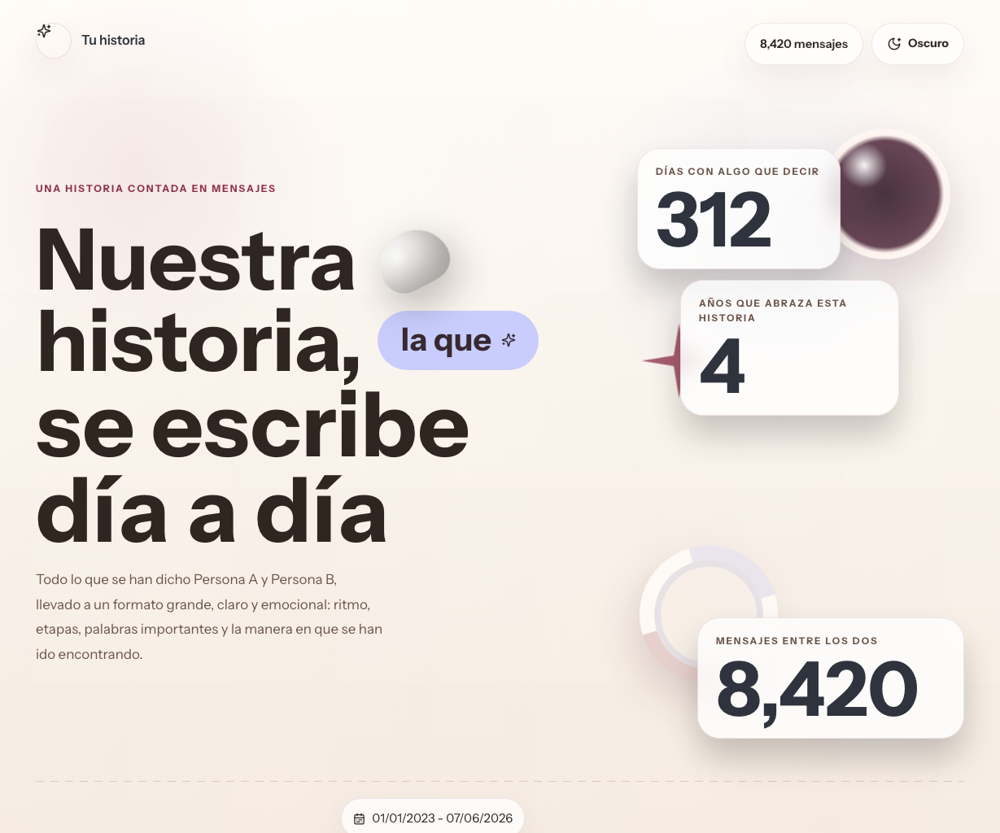
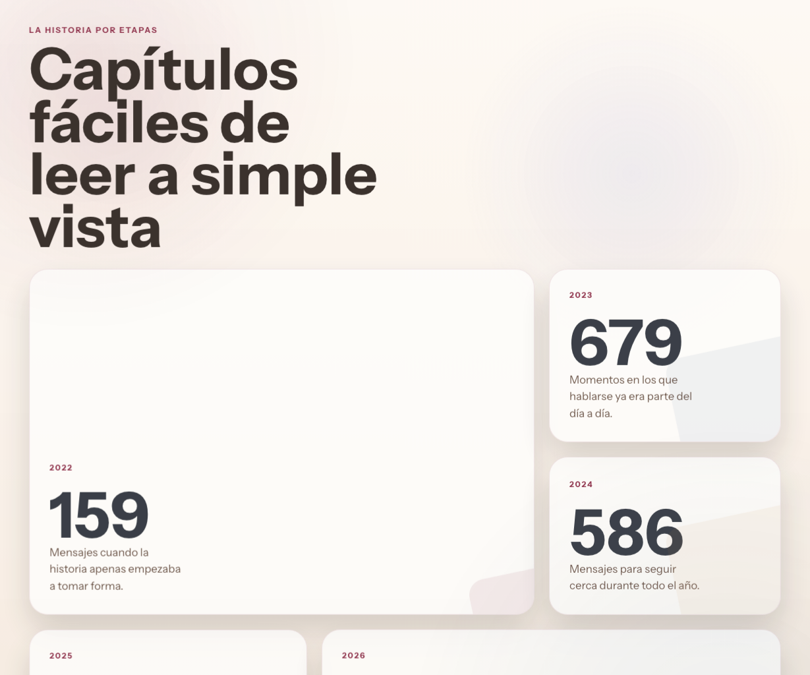

# Our Story

Proyecto personal, hecho just for fun, para convertir una conversación de WhatsApp en una historia visual: grande, clara, romántica y fácil de leer en desktop o mobile.

La idea no es hacer analítica “seria”, sino tomar mensajes, fechas, frases y tipos de media reales para presentarlos como una experiencia narrativa.

Las capturas de abajo usan valores de ejemplo, no datos privados reales.





## Qué muestra

El sitio puede calcular y presentar cosas como estas entre dos personas:

- `messages_total`
- `messages_by_year`
- `messages_by_month`
- `messages_by_sender`
- `words_by_sender`
- `active_days`
- `top_day`
- `timeline_milestones`
- `published_at`
- `tracked_phrase_count`
- `first_tracked_phrase_at`
- `media_photos`
- `media_audios`
- `media_videos_gifs`
- `media_stickers`

En este repo la frase destacada por defecto es `te amo`, pero la intención es que puedas cambiarla por cualquier otra que te interese medir.

## Cómo funciona

Este proyecto combina hasta tres fuentes locales:

1. `chat_bk/WhatsApp Chat - .../_chat.txt`
2. la base normalizada de `wacrawl` (`~/.wacrawl/wacrawl.db`)
3. una caché local incremental en `.private/`

Con eso arma:

- una exportación privada para desarrollo local
- un resumen público seguro para GitHub Pages
- una historia visual derivada de esos datos

## Setup

```bash
npm install
```

Si quieres leer mensajes recientes desde WhatsApp Desktop, instala `wacrawl`:

```bash
brew install steipete/tap/wacrawl
# o
go install github.com/steipete/wacrawl/cmd/wacrawl@latest
```

## Configuración local

Usa el archivo de ejemplo como base:

```bash
cp env.example .env.local
```

Luego ajusta estos valores:

| Variable | Para qué sirve |
| --- | --- |
| `BABE_CHAT_JID` | Identificador del chat objetivo |
| `BABE_CHAT_NAME` | Nombre detectado en la fuente local |
| `BABE_DISPLAY_NAME` | Nombre bonito que quieres mostrar en la UI |
| `BABE_CHAT_PHONE` | Teléfono del contacto, si lo necesitas para la búsqueda |
| `ME_DISPLAY_NAME` | Nombre con el que te quieres mostrar en la historia |
| `STORY_BRAND_LABEL` | Label corto del home, por ejemplo `Nuestra historia` |
| `AUTHOR_SIGNATURE` | Firma visible del footer |
| `WHATSAPP_TIMEZONE` | Zona horaria usada para días, horas e hitos |

## Inputs esperados

Puedes usar uno o varios de estos inputs:

- un backup exportado a `chat_bk/`
- WhatsApp Desktop sincronizado con `wacrawl`
- la caché local incremental que el proyecto va manteniendo

Si solo tienes un `.txt` completo, también funciona.  
Si solo tienes WhatsApp Desktop sincronizado, también funciona.  
Si tienes ambos, el proyecto mezcla historia vieja + mensajes recientes.

## Paso a paso

1. Instala dependencias:

```bash
npm install
```

2. Prepara tu config local:

```bash
cp env.example .env.local
```

3. Si vas a usar backup exportado, colócalo en una carpeta como:

```text
chat_bk/WhatsApp Chat - Persona B/_chat.txt
```

4. Si vas a usar mensajes recientes desde WhatsApp Desktop, instala y deja listo `wacrawl`.

5. Genera la historia local:

```bash
npm run export
```

6. Abre la app en local:

```bash
npm run dev
```

7. Si quieres actualizar GitHub Pages con el resumen público:

```bash
npm run publish
```

Ese comando:

- corre el export
- actualiza el resumen público
- actualiza el sello visible de `Importado ...`
- hace commit del JSON público
- empuja a `main`

## Qué puedes personalizar

### 1. Los nombres visibles

Se cambian desde `.env.local`:

- `ME_DISPLAY_NAME`
- `BABE_DISPLAY_NAME`
- `STORY_BRAND_LABEL`
- `AUTHOR_SIGNATURE`

### 2. La frase que quieres medir

Hoy el repo viene orientado a `te amo`, pero si quieres medir otra frase:

- cambia la lógica en [src/lib/phrases.ts](src/lib/phrases.ts)
- revisa cualquier copy asociado en [src/App.tsx](src/App.tsx)
- si quieres cambiar el tono narrativo, ajusta [src/lib/story.ts](src/lib/story.ts)

### 3. El ícono de la frase destacada

La sección visual de la frase vive en [src/App.tsx](src/App.tsx).  
Si cambias de `te amo` a otra cosa, ahí puedes cambiar también el ícono para que haga sentido con tu historia.

### 4. La línea visual

La guía visual completa está en [DESIGN.md](DESIGN.md):

- paleta claro / oscuro
- tipografía
- comportamiento del timeline
- animaciones
- reglas para nuevas secciones

## Scripts

```bash
npm run export    # mezcla backup + mensajes recientes y regenera la historia
npm run publish   # actualiza el resumen público y lo empuja a main
npm run dev       # abre la app local
npm run build     # genera el build estático
npm run harness   # validaciones locales y privacidad
npm run test      # unit tests
```

## Privacidad

La intención del repo es publicar código y un resumen seguro, no tu conversación cruda.

Los insumos y salidas privadas se quedan fuera de git por defecto:

- `.env.local`
- `chat_bk/`
- `.private/`
- `public/data/`
- `public/private-media/`

La versión pública de GitHub Pages usa un resumen sin transcript completo ni media privada.

## Notas

- El proyecto está pensado para una historia entre dos personas, pero la base puede adaptarse.
- Las capturas del README son de ejemplo para explicar la estructura, no para exponer datos reales.
- Si agregas una sección nueva, intenta mantener las mismas reglas visuales y narrativas del proyecto.
